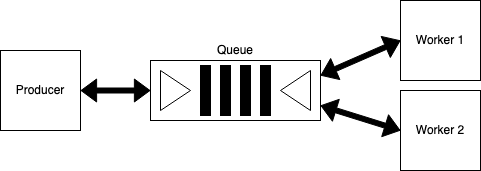
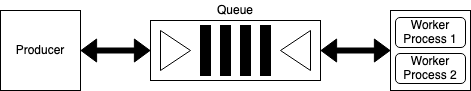
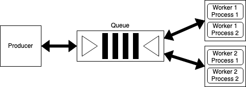

# A Dockerized Framework for Distributed, Asynchronous Tasks
A containerized framework for distributed, asynchronous tasks with Python Celery (#petitionforaceleryemoji), RabbitMQ 🐰, and Reddis 🥬 (get it? Reddis like "lettuce").

See a more detailed discussion in my post [Dockerized Distributed, Asynchronous Work](https://oliviafryt.com/posts/docker_celery_rq.html).

## Technologies:
* Python 3.9
* Celery==5.0.5
* RabbitMQ (latest Docker image)
* Reddis (latest Docker image)

## Build and Run
``` bash
docker-compose build && docker-compose up -d
```

## Framework
Use this framework to jumpstart your distributed and/or asynchronous application! Before use, take note of the following:
1. Edit the environment variables accordingly in ```docker-compose.yml```:
  * ```RABBITMQ_DEFAULT_USER``` and ```RABBITMQ_DEFAULT_PASS``` in the **rabbitmq** container and ```BROKER_USER```, ```BROKER_PASS```, ```BROKER_HOST```, and ```BROKER_PORT``` in the **producer** and worker (**worker1** and **worker2**) containers are the respective username, password, hostname, and port for the RabbitMQ connection.
  * ```BACKEND_HOST``` and ```BACKEND_PORT``` in the **producer** and worker (**worker1** and **worker2**) containers are the respective hostname and port for the Redis connection.
  * ```CONCURRENCY``` in the worker (**worker1** and **worker2**) containers is the number of workers running in a single worker docker container concurrently.
  * ```LOGLEVEL``` in the worker (**worker1** and **worker2**) containers is the desired logging level passed to Celery.
2. Tasks can be distributed among as many or as few containers as desired, just by adjusting the ```scale``` value in ```docker-compose.yml```. In this example, two worker containers are spawned.
3. The Celery app configuration in the **producer** (found in ```producer/produce.py```) and **consumer** (found in ```consumer/consume.py```) must be the same in order to ensure tasks are being pushed and pulled from the same, correct queue.
4. Celery tasks can be invoked in multiple ways, one of the most straight forward being to be invoked by name. In this example, we are indeed invoking the ```square``` task by name. See the task decorator on [line 14](https://github.com/frytoli/distributed-celery-docker/blob/350145723beb1fb85a8a2cb47a914d171166c745/consumer/consume.py#L14) in ```consumer/consume.py``` and the task invocation on [line 21](https://github.com/frytoli/distributed-celery-docker/blob/350145723beb1fb85a8a2cb47a914d171166c745/producer/produce.py#L21) in ```producer/produce.py```.
5. Output from processes managed by supervisord in the **producer** and worker (**worker1** and **worker2**) containers is all set to be redirected to stdout and stderr. This can be changed to a different file or removed entirely in ```producer/conf/supervise-producer.conf``` and ```consumer/conf/supervise-consumer.conf```.

## Distributed Work


## Asynchronous Work


## Distributed and Asynchronous Work

